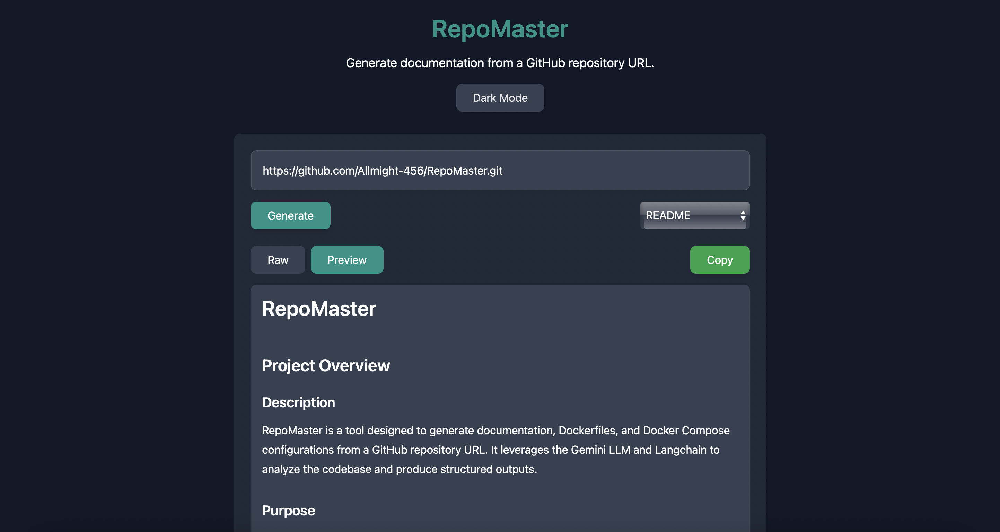

# RepoMaster

[Visit](https://repomaster.vercel.app)
## Project Overview

### Description
RepoMaster is a tool designed to generate documentation, Dockerfiles, and Docker Compose configurations from a GitHub repository URL. It leverages the Gemini LLM and Langchain to analyze the codebase and produce structured outputs.

### Purpose
The primary goal of RepoMaster is to automate the creation of essential project documentation and containerization configurations, saving developers time and ensuring consistency.

### Key Features
*   **Documentation Generation:** Generates a comprehensive README file for a given repository.
*   **Dockerfile Generation:** Creates a Dockerfile tailored to the project's needs.
*   **Docker Compose Generation:** Generates a Docker Compose configuration for multi-container applications.
*   **API Endpoints:** Provides API endpoints for generating documentation, Dockerfiles, and Docker Compose configurations.
*   **Dark Mode Support:** Offers a dark mode option for the frontend interface.

### Target Audience
RepoMaster is intended for developers, DevOps engineers, and anyone who needs to quickly generate documentation or containerize applications.

## Setup Instructions

### Prerequisites
*   **Backend:**
    *   Python 3.6+
    *   `pip` package manager
    *   `repomix` (installed globally via npm)
    *   Google Cloud API Key
*   **Frontend:**
    *   Node.js
    *   npm or yarn

### Installation

#### Backend
1.  Clone the repository.
2.  Navigate to the `backend` directory.
3.  Create a virtual environment (optional but recommended):
    ```bash
    python3 -m venv venv
    source venv/bin/activate  # On Linux/macOS
    venv\Scripts\activate  # On Windows
    4.  Install the required Python packages:
    ```bash
    pip install -r requirements.txt
    5.  Set the `GOOGLE_API_KEY` environment variable with your Google Cloud API key. You can do this by creating a `.env` file in the `backend` directory:
        GOOGLE_API_KEY=YOUR_API_KEY
    6.  Install Repomix globally using npm:
    ```bash
    npm install -g repomix
        Alternatively, you can use the provided `install_repomix.sh` script:
    ```bash
    chmod +x install_repomix.sh
    ./install_repomix.sh
    
#### Frontend
1.  Navigate to the `frontend` directory.
2.  Install the required Node.js packages:
    ```bash
    npm install
    # or
    yarn install
    
### Configuration

#### Backend
*   The backend server runs on port 8000 by default. This can be changed in `backend/main.py`.
*   The Google Cloud API key must be set as an environment variable.

#### Frontend
*   The frontend connects to the backend server at `http://127.0.0.1:8000`. This can be changed in `frontend/src/App.jsx`.

### First-Time Run

#### Backend
1.  Navigate to the `backend` directory.
2.  Run the FastAPI application:
    ```bash
    uvicorn main:app --host 0.0.0.0 --port 8000 --reload
    
#### Frontend
1.  Navigate to the `frontend` directory.
2.  Start the Vite development server:
    ```bash
    npm run dev
    # or
    yarn dev
    3.  Open your browser and navigate to the address provided by Vite (usually `http://localhost:5173`).

## Core Modules and Architecture

### Components

*   **Backend (FastAPI):**
    *   `main.py`: Contains the FastAPI application and API endpoints.
    *   `prompts.py`: Defines the prompts used by the LLM for generating documentation, Dockerfiles, and Docker Compose configurations.
    *   `__init__.py`: Marks the directory as a Python package and imports necessary prompts.
*   **Frontend (React):**
    *   `App.jsx`: Contains the main application logic and UI components.
    *   `index.jsx`: Entry point for the React application.

### Relationships
The frontend interacts with the backend via HTTP requests to the API endpoints. The backend uses Langchain and Gemini LLM to process the codebase and generate the desired outputs.

### Key Functionalities
*   **Backend:**
    *   Receives GitHub repository URLs from the frontend.
    *   Uses `repomix` to fetch the codebase content.
    *   Uses Langchain and Gemini LLM to generate documentation, Dockerfiles, and Docker Compose configurations based on predefined prompts.
    *   Returns the generated output to the frontend.
*   **Frontend:**
    *   Provides a user interface for entering a GitHub repository URL.
    *   Sends requests to the backend to generate documentation, Dockerfiles, or Docker Compose configurations.
    *   Displays the generated output in a raw or preview format.

## API Endpoints

### Endpoint List
*   `POST /generate-docs-from-url`: Generates a README file from a GitHub repository URL.
*   `POST /generate-dockerfile`: Generates a Dockerfile from a GitHub repository URL.
*   `POST /generate-docker-compose`: Generates a Docker Compose configuration from a GitHub repository URL.
*   `GET /ping`: A lightweight route to confirm the server is running.

### Request/Response Formats
All POST endpoints accept a JSON payload with the following format:

```json
{
  "url": "https://github.com/owner/repo"
}

The response format varies depending on the endpoint:

*   `/generate-docs-from-url`:
    ```json
    {
      "readme": "Generated README content in Markdown format"
    }
    *   `/generate-dockerfile`:
        Generated Dockerfile content
    *   `/generate-docker-compose`:
    ```yaml
    Generated Docker Compose configuration in YAML format
    
### Authentication
No authentication is required for these endpoints.

### Example Requests

```bash
curl -X POST -H "Content-Type: application/json" -d '{"url": "https://github.com/owner/repo"}' http://127.0.0.1:8000/generate-docs-from-url

### Error Handling
The API returns HTTP status codes to indicate success or failure. In case of an error, the response body will contain a JSON object with a `detail` field describing the error.

## Usage Examples

### Common Use Cases
*   Quickly generate a README file for a new project.
*   Automate the creation of Dockerfiles and Docker Compose configurations for containerizing applications.
*   Generate documentation for existing projects to improve maintainability.

### Best Practices
*   Use a clear and descriptive GitHub repository URL.
*   Review the generated output and make any necessary adjustments.
*   Ensure that the Google Cloud API key is properly configured.

## Dependencies

### Libraries and Tools

#### Backend
*   fastapi
*   python-dotenv
*   pydantic
*   langchain-google-genai
*   uvicorn
*   requests
*   python-multipart
*   langchain
*   repomix (installed globally via npm)

#### Frontend
*   react
*   react-dom
*   axios
*   react-markdown
*   tailwindcss
*   autoprefixer
*   postcss

### System Prerequisites
*   Python 3.6+
*   Node.js
*   npm or yarn

### External Services
*   Google Cloud API (for Gemini LLM)
*   GitHub (for fetching codebase content)

## Future Improvements and Roadmap

### Planned Enhancements
*   Support for different LLMs.
*   Customizable prompts.
*   Integration with CI/CD pipelines.
*   Improved error handling and logging.
*   More comprehensive documentation generation.

### Optimization Opportunities
*   Optimize the prompts for better output quality.
*   Improve the performance of the backend server.
*   Reduce the size of the frontend bundle.

### Known Limitations
*   The quality of the generated output depends on the quality of the codebase and the prompts used.
*   The API may be rate-limited by the Google Cloud API.
*   Binary files are not included in the codebase analysis.
